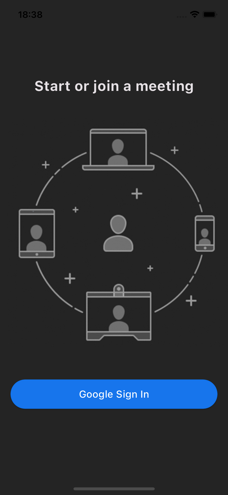
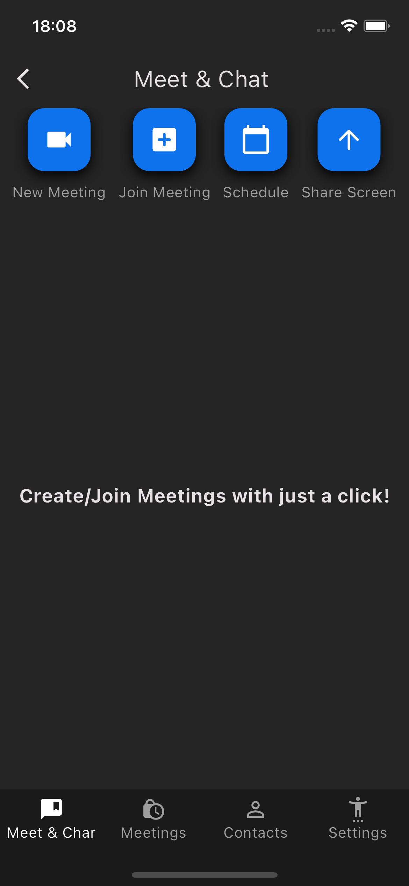
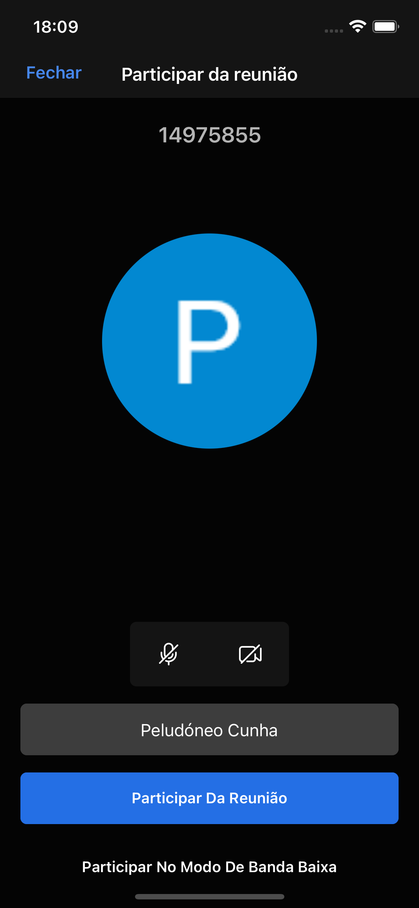
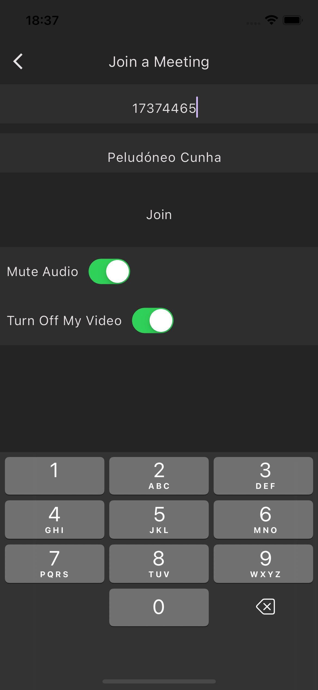
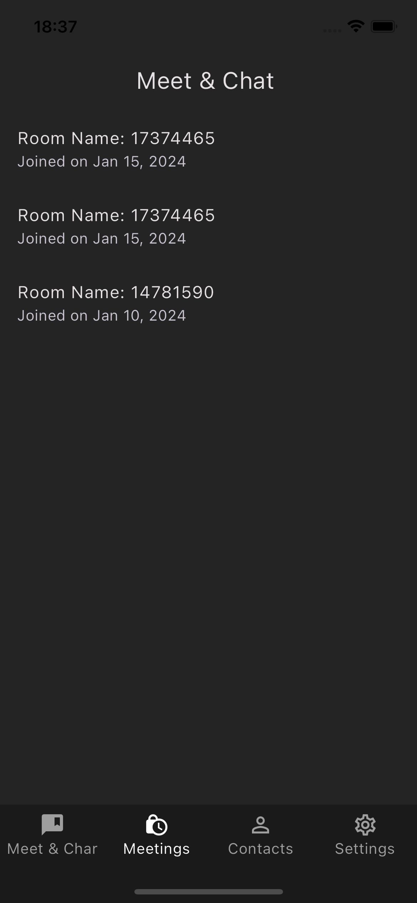
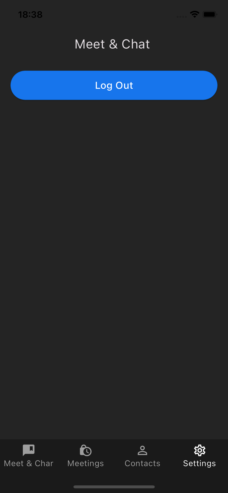

# Zoom Clone App 

Introducing Zoom Clone, a Flutter mobile application that provides a seamless video conferencing experience mimicking the original Zoom app.

Powered by the Dart programming language and the Flutter framework, Zoom Clone utilizes Firebase Auth and Firebase Firestore for user authentication and data storage, ensuring secure and reliable functionality. Employing the "jitsi_meet_flutter_sdk" package from Pub.dev, the app replicates the Zoom app's video conferencing feature, allowing users to connect and collaborate seamlessly.

By closely replicating the original Zoom app's user interface, Zoom Clone provides a familiar and intuitive experience for users. With all the Zoom app's core features integrated, Zoom Clone offers a comprehensive and reliable video conferencing solution for individuals and teams.

This project showcases the power of Flutter and Firebase in building feature-rich mobile applications with ease and scalability.

## Features
* Google Sign In
* Create New Meeting
* Join Meeting
* Mute/Unmute Audio
* Mute/Unmute Video
* Change Display Name while Joining
* Start Screen Sharing
* Mute Everyone
* Start Live Stream
* Chat
* Start Live Stream
* Disable Camera
* End Call
* Log out

## Screenshots
  

  

## Documentation

- [Documentation jitsi_meet_flutter_sdk](https://pub.dev/packages/jitsi_meet_flutter_sdk)
- [Cookbook: Useful Flutter samples](https://flutter.dev/docs/cookbook)

## Environment Variables
To run this project, you will need to add the following environment variables to your pubspec.yaml file

* `jitsi_meet_flutter_sdk: ^0.1.9`

## Tech Stack

* **Client:** Fluter, Dart
* **Database:** Google Firebase

## Lessons Learned
* Learn about how implement Google SignIn
* Learn about how to add video conference in app
* Learn about how to design Ui in flutter
* Learn about how cross-paltform app work

## License

[MIT](https://choosealicense.com/licenses/mit/)

## Feedback

If you have any feedback, please reach out to me at eufrazinocunhaDev99@gmail.com
